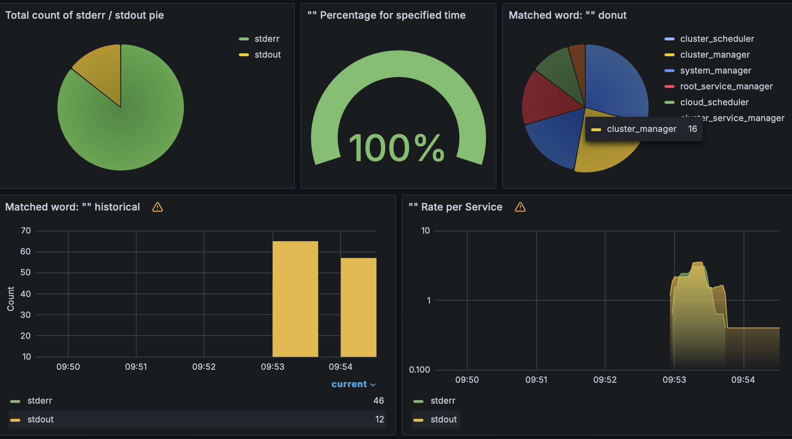
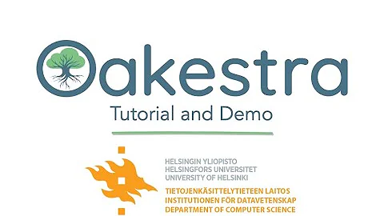

We are proud to announce that Oakestra v0.4.301 (codename: **Accordion** 🪗) is here! *This is also the first major release for Oakestra and marks the beginning of a periodic release cycle.*

Here are the new features introduced in this version!















## Unikraft meets Oakestra!


A new deployment type, `unikernel` is now available for your deployments. 

In the code section, you can now provide the link to an OCI image for containers as well as the link to a .tar.gz file for unikernel deployments (e.g., `http://<hosting-url-and-port>/nginx_amd64.tar.gz`). 

If a unikernel image is provided you need to add the architecture selector based on the kernel file compatibility. E.g., `"arch": ["amd64"]`, this way the scheduler will place the image only on `amd64` machines with an active unikernel runtime.  

Try out this deployment descriptor to deploy your first [unikraft](unikraft.org) powered Nginx service.

```json
{
      "microservices": [
        {
          "microserviceID": "",
          "microservice_name": "nginx",
          "microservice_namespace": "nginx",
          "virtualization": "unikernel",
          "cmd": [""],
          "memory": 400,
          "vcpus": 1,
          "vgpus": 0,
          "vtpus": 0,
          "code": "https://github.com/oakestra/oakestra/releases/download/alpha-v0.4.301/nginx_amd64.tar.gz",
          "arch": [
            "amd64"
          ],
          "state": "",
          "port": "80:80",
          "addresses": {},
          "added_files": [],
          "constraints": []
        }
    ]
}
```

 
To enable a unikraft capable worker node in your cluster, you simply need to:

- Install KVM
- Run your node engine as usual but using the `-u=true`. E.g., `sudo NodeEngine -n 6000 -p 10100 -a <Cluster Orchestrator IP Address> -u=true`




A general unikraft unikernel tar file should be composed as follows:

```bash
mytar.tar.gz
|
|- kernel  (your unikraft kernel file)
|- files1/ (a folder containing additional files you need)
```

## Oakestra semantic overlay networking now speaks IPv6

The semantic overlay network has been extending to support up to 30 balancing policies in parallel thanks to the new IPv6 implementation. This also enables the provisioning of bigger clusters of resources with up to `2^113` worker nodes. 

To provision a round robin IPv6 address to your service you can use the `rr_ip_v6` keyword in your deployment descriptor as follows:

```json
{
    "microserviceID": "",
    "microservice_name": "nginx",
    "microservice_namespace": "test",
    "virtualization": "container",
    "cmd": [],
    "memory": 100,
    "vcpus": 1,
    "vgpus": 0,
    "vtpus": 0,
    "bandwidth_in": 0,
    "bandwidth_out": 0,
    "storage": 0,
    "code": "docker.io/library/nginx:latest",
    "state": "",
    "port": "",
    "addresses": {
        "rr_ip": "10.30.55.55",
        "rr_ip_v6": "fdff:2000::55:55"
    },
    "added_files": [],
    "constraints": []
}
```

 IPv6 round robin addresses must all be part of the subnetwork `fdff:2000::`, same way as IPv4 round robin addresses must be part of the `10.30.0.0` subnetwork. 


## Dashboard service logs 


The service status page of your dashboard now provides the `stdout`and `stderr` streams of your instances.  

## Orchestrator Grafana alerts and cluster logs



Your root orchestrator and cluster orchestrator now expose a Grafana dashboard showing the current control plane status, logs, and alerts. 

Access it via:
- From the frontend click the `Infrastructure Dashboard` button
- Or directly at 
    - `<root_orchestrator_ip>:3000` for the root dashboard
    - `<cluster_orchestrator_ip>:3001` for the cluster dashboard

 
1-DOC deployments will only expose a unique root-cluster dashboard at `<root_orchestrator_ip>:3000`


## One-shot service deployment

You can now deploy one-shot services, as instances that are executed then are marked as completed when the execution ends without triggering a re-deployment. Simply add the `"one_shot": true` key-word to your deployment descriptor. 


For example, a `curl` one-shot client looks like this:

```json
{
      "microservices" : [
        {
          "microserviceID": "",
          "microservice_name": "curl",
          "microservice_namespace": "test",
          "virtualization": "container",
          "cmd": ["sh", "-c", "curl 10.30.55.55 ; sleep 5"],
          "memory": 100,
          "vcpus": 1,
          "vgpus": 0,
          "vtpus": 0,
          "bandwidth_in": 0,
          "bandwidth_out": 0,
          "storage": 0,
          "code": "docker.io/curlimages/curl:7.82.0",
          "state": "",
          "port": "",
          "added_files": [],
          "one_shot": true,
          "constraints":[]
        },
        ...
    ]
}
```

## Quick way to start your Oakestra cluster

Now you can kickstart start a full [1-DOC Cluster](https://www.oakestra.io/docs/getstarted/get-started-cluster/#1-doc-1-device-one-cluster) using a single command:

```bash
curl -sfL oakestra.io/getstarted.sh | sh - 
```

## Resource abstractor (part one)

We'll slowly abstract the concept of worker or cluster to a general aggregation of resoruces and capabilities. This will enable more general schedulers, which will be easier to replace and improve.  

The first step is the `root resource abstractor` component, which gathers the capabilities of a cluster and exposes a standardized interface to the root scheduler. 

In upcoming releases, we'll bring this component to the cluster as well, making the scheduler components finally interchangeable and pluggable. 

## Community Activities

### Oakestra as feature education tool in the University of Helsinki 🇫🇮



Oakestra was invited as default framework in the course "Networked AI Systems" offered in the University of Helsinki. [Giovanni Bartolomeo](https://www.giovannibartolomeo.it/) gave a guest lecture to an audience of 80+ students and the students were invited to use Oakestra to build various edgeAI applications and usecases. 



### Oakestra was inivited to IETF 119 in Australia 🇦🇺 

Internet Engineering Task Force (IETF) is a standards organization for the Internet and is responsible for the technical standards that make up the Internet. Oakestra was invited to attend the **Exposure of Network and Compute information to Support Edge Computing Applications** [side-meeting](https://github.com/communication-compute-exposure/ietf-side-meetings/tree/main/ietf-119-side-meeting) to showcase how applications can be accelerated within Oakestra by sharing internal QoS metrics. 



Oakestra was well-appreciated by the IETFers and is making strides as leading orchestration framework for managing edge computing applications and infrastructures.
 
 
Oakestra developers are hard at work on the next release, which will include several new features and improvements, such as: 

- More simplified startup process including porting to `systemd`
- Federated Learning workloads support via FLOps
- Plugin interface and Okaestra plugin marketplace 
- Gateway component for external workloads 
- K8s cluster integration
- ... and more 


#### Acknowledgments:

Many thanks to our new contributors for this release:

- [@smnzlnsk](https://github.com/smnzlnsk)
- [@Sabanic-P](https://github.com/Sabanic-P)
- [@Malyuk-A](https://github.com/Malyuk-A)
- [@melkodary](https://github.com/melkodary)
- [@TheDarkPyotr](https://github.com/TheDarkPyotr)